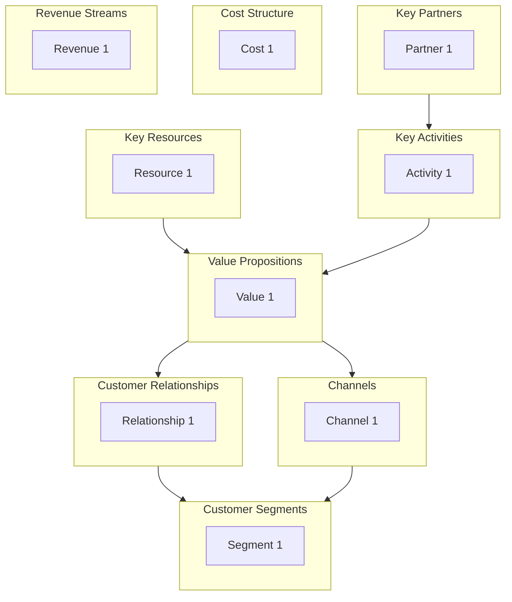

# Business Model Canvas Command

Create a structured business model using Osterwalder's Business Model Canvas or Maurya's Lean Canvas to visualize and design how an organization creates, delivers, and captures value.

## Arguments

- `<business-description>`: Description of the business, startup, or initiative to model
- `--mode`: Canvas type (default: `bmc`)
  - `bmc`: Full Business Model Canvas (~8K tokens)
  - `lean`: Lean Canvas for startups (~6K tokens)
  - `quick`: Rapid single-pass canvas (~3K tokens)
- `--output`: Output format (default: `both`)
  - `yaml`: Structured YAML for downstream processing
  - `mermaid`: Mermaid diagram visualization
  - `both`: Both formats

- `--dir`: Output directory (default: `docs/analysis/`)

## Execution

### Step 1: Parse Arguments

Extract business description, mode, and output format from arguments.

If no description provided, ask the user:
"What business, product, or initiative would you like to create a canvas for?"

Default mode is `bmc`. Default output is `both`.

### Step 2: Load Business Model Canvas Skill

Invoke the `business-model-canvas` skill to access:

- 9-block canvas structure
- Block definitions and examples
- Value proposition types
- Revenue model patterns
- Lean Canvas adaptations

### Step 3: Execute Based on Mode

#### BMC Mode (Full Business Model Canvas)

Work through all 9 blocks interactively (right-to-left order):

**Demand Side (Start Here):**

1. **Customer Segments**: Who are the most important customers?
   - Segment types: Mass market, Niche, Segmented, Diversified, Multi-sided

2. **Value Propositions**: What value do we deliver to each segment?
   - Value types: Newness, Performance, Customization, Price, Convenience

3. **Channels**: How do we reach and deliver to customers?
   - Phases: Awareness, Evaluation, Purchase, Delivery, After-sales

4. **Customer Relationships**: How do we interact with each segment?
   - Types: Personal, Dedicated, Self-service, Automated, Communities

5. **Revenue Streams**: How does each segment pay?
   - Models: Asset sale, Usage fee, Subscription, Licensing, Advertising

**Supply Side:**

6. **Key Resources**: What do we need to deliver value?
   - Types: Physical, Intellectual, Human, Financial

7. **Key Activities**: What must we do well?
   - Types: Production, Problem Solving, Platform/Network

8. **Key Partnerships**: Who helps us?
   - Types: Strategic alliances, Coopetition, Joint ventures, Suppliers

9. **Cost Structure**: What are major costs?
   - Focus: Cost-driven vs Value-driven

After filling all blocks, validate coherence:

- Does value proposition address segment needs?
- Do channels reach segments effectively?
- Do revenues exceed costs?

#### Lean Mode (Startup Canvas)

Adapted blocks for early-stage ventures:

1. **Problem** (replaces Key Partners): Top 3 problems to solve
2. **Solution** (replaces Key Activities): Top 3 features
3. **Key Metrics** (replaces Key Resources): Numbers that matter
4. **Unfair Advantage** (replaces Customer Relationships): Cannot be copied

Shared blocks: Customer Segments, Value Proposition, Channels, Revenue Streams, Cost Structure

Focus on problem-solution fit and early adopters.

#### Quick Mode (Rapid Fill)

Single-pass canvas completion:

1. Start with value proposition and customer segment
2. Infer other blocks from context
3. Skip detailed breakdowns
4. Generate minimal viable canvas
5. Mark assumptions for later validation

### Step 4: Generate Output Artifacts

#### YAML Output

```yaml
business_model_canvas:
  version: "1.0"
  organization: "[Business Name]"
  date: "[ISO Date]"
  type: "business_model_canvas"  # or "lean_canvas"
  analyst: "canvas-facilitator"

  customer_segments:
    - name: "[Segment Name]"
      description: "[Who are they?]"
      size: "[Market size estimate]"
      priority: primary  # or secondary

  value_propositions:
    - segment: "[Segment Name]"
      proposition: "[Value delivered]"
      type: convenience  # newness, performance, customization, price, etc.
      differentiation: "[Why us?]"

  channels:
    - phase: awareness
      channel: "[Channel name]"
      type: own  # or partner
      effectiveness: high

  customer_relationships:
    - segment: "[Segment Name]"
      type: self_service
      purpose: retention  # acquisition, retention, upselling

  revenue_streams:
    - segment: "[Segment Name]"
      type: subscription
      pricing: fixed  # or dynamic
      percentage: 80

  key_resources:
    - name: "[Resource]"
      category: intellectual  # physical, intellectual, human, financial
      source: own
      importance: critical

  key_activities:
    - activity: "[Activity]"
      category: production  # production, problem_solving, platform
      importance: critical

  key_partnerships:
    - partner: "[Partner Name]"
      type: strategic_alliance
      motivation: acquisition  # optimization, risk_reduction, acquisition
      provides: "[What they provide]"

  cost_structure:
    focus: value_driven  # cost_driven or value_driven
    costs:
      - category: "[Cost category]"
        type: fixed  # fixed or variable
        percentage: 40

  validation:
    value_customer_fit: true
    channel_segment_fit: true
    revenue_cost_balance: true
```

#### Mermaid Output



#### Summary Report

```markdown
## Business Model Canvas: [Organization]

**Date:** [ISO Date]
**Type:** Business Model Canvas / Lean Canvas

### Executive Summary

[2-3 sentence summary of the business model]

### Customer Focus

- **Primary Segment:** [Description]
- **Value Delivered:** [Core value proposition]
- **Channels:** [Primary channels]

### Value Creation

- **Key Activities:** [Core activities]
- **Key Resources:** [Critical resources]
- **Key Partners:** [Strategic partners]

### Financial Model

- **Revenue Model:** [How money is made]
- **Cost Structure:** [Major cost drivers]
- **Unit Economics:** [Key metrics]

### Risks and Assumptions

| Block | Assumption | Risk Level |
|-------|------------|------------|
| [Block] | [Assumption] | High/Med/Low |

### Recommendations

1. [Validate assumption X]
2. [Explore channel Y]
3. [Consider partnership Z]
```

### Step 5: Save Results

Save outputs based on format flag:

**YAML file:**

- `docs/analysis/business-model-canvas.yaml`

**Mermaid diagram:**

- `docs/analysis/business-model-canvas.md`

Use `--dir` to specify a custom output directory.

### Step 6: Suggest Follow-Up Actions

After completing canvas:

```markdown
## Suggested Next Steps

1. **Strategic Context**: Use `/ba:swot-analysis` to understand environmental factors
2. **Value Stream**: Use `/ba:value-stream` to optimize value delivery
3. **Stakeholder Mapping**: Use `/ba:stakeholder-analyze` to identify key relationships
4. **Validation Planning**: Test riskiest assumptions with customers
```
