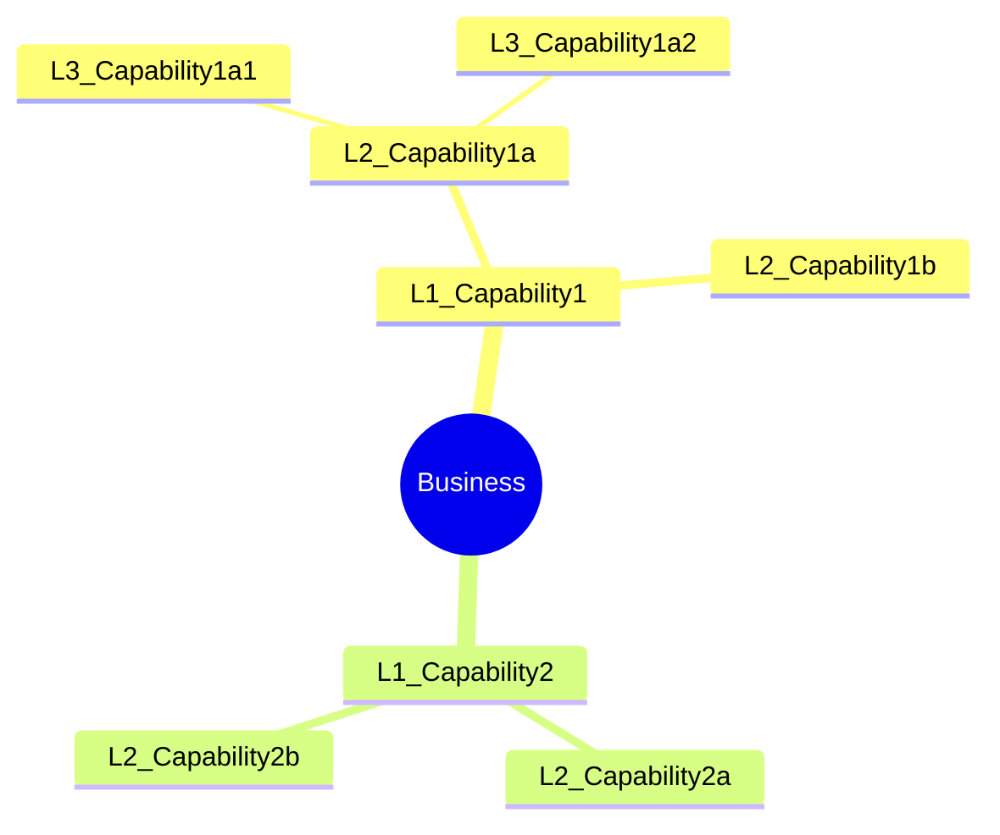

# Capability Map Command

Create a hierarchical business capability model to understand what an organization does, independent of how it's implemented or who performs the work.

## Arguments

- `<business-description>`: Description of the business, organization, or domain to analyze
- `--mode`: Analysis mode (default: `guided`)
  - `full`: Multi-persona discovery with strategic alignment (~12K tokens)
  - `quick`: Single analysis pass (~4K tokens)
  - `guided`: Interactive capability discovery (variable)
- `--output`: Output format (default: `both`)
  - `yaml`: Structured YAML for downstream processing
  - `mermaid`: Mermaid diagram visualization
  - `both`: Both formats

- `--dir`: Output directory (default: `docs/analysis/`)

## Execution

### Step 1: Parse Arguments

Extract business description, mode, and output format from arguments.

If no description provided, ask the user:
"What business, organization, or domain would you like to create a capability map for?"

Default mode is `guided`. Default output is `both`.

### Step 2: Load Capability Mapping Skill

Invoke the `capability-mapping` skill to access:

- Capability hierarchy frameworks
- Industry-specific templates
- Maturity assessment rubric
- Cross-mapping guidance

### Step 3: Execute Based on Mode

#### Full Mode (Multi-Persona Discovery)

Spawn the `capability-analyst` agent for comprehensive analysis:

```text
Analyze this business and create a complete capability model:

[Business description]

Requirements:
1. Analyze business context using stakeholder interviews and documentation review
2. Create L1-L3 capability hierarchy
3. Classify each capability (Strategic, Core, Supporting, Generic)
4. Assess current maturity (1-5 scale)
5. Identify capability gaps and opportunities
6. Generate both YAML and Mermaid outputs
```

The agent will:

- Leverage EA discovery patterns
- Build hierarchical model with cross-mapping
- Assess maturity and identify gaps
- Produce comprehensive documentation

#### Quick Mode (Single Pass)

Perform rapid capability identification:

1. Identify obvious L1 capabilities from business description
2. Decompose L1s into L2 capabilities
3. Apply industry template overlays if applicable
4. Skip detailed maturity assessment
5. Generate minimal hierarchy

#### Guided Mode (Interactive)

Work interactively through capability discovery using structured questions.

##### Step G1: Scope and Depth Selection

Use AskUserQuestion to determine scope upfront:

```yaml
# Question 1: Scope Selection (MCP: CLI best practices - MVP vs Full)
question: "How comprehensive should the capability model be?"
header: "Scope"
options:
  - label: "MVP (Recommended)"
    description: "L1-L2 capabilities only, fast execution (~15 min)"
  - label: "Standard"
    description: "L1-L3 capabilities with classification (~30 min)"
  - label: "Comprehensive"
    description: "Full hierarchy with maturity assessment (~60 min)"

# Question 2: Output Format (MCP: CLI best practices - format selection)
question: "What output formats do you need?"
header: "Format"
multiSelect: true
options:
  - label: "Mermaid Diagram"
    description: "Visual mindmap of capability hierarchy"
  - label: "YAML Structure"
    description: "Structured data for downstream tools"
  - label: "Summary Report"
    description: "Markdown narrative with analysis"
```

##### Step G2: L1 Discovery

Ask "What are the main capabilities this organization needs?"

Based on scope from G1:

- MVP: Stop at L1-L2
- Standard: Continue to L3
- Comprehensive: Full depth with maturity

##### Step G3: L2 Decomposition

For each L1, ask "What component capabilities make this up?"

**Step G4: Classification** (Standard/Comprehensive only)

For each capability, confirm classification:

- Strategic (differentiating)
- Core (essential operations)
- Supporting (enables core)
- Generic (commodity)

**Step G5: Maturity Assessment** (Comprehensive only)

Assess current state vs. target state (1-5 scale).

##### Step G6: Gap Identification and Prioritization

Identify missing or weak capabilities and rank by strategic importance.

### Step 4: Generate Output Artifacts

#### YAML Output

```yaml
capability_model:
  version: "1.0"
  domain: "[Business Name]"
  generated: "[ISO Date]"
  mode: "[full|quick|guided]"

  capabilities:
    - name: "[L1 Capability]"
      level: 1
      type: core  # strategic, core, supporting, generic
      maturity: 3
      target_maturity: 4
      children:
        - name: "[L2 Capability]"
          level: 2
          type: core
          maturity: 2
          target_maturity: 4
          children:
            - name: "[L3 Capability]"
              level: 3
              type: supporting
              maturity: 3
              target_maturity: 3
```

#### Mermaid Output



#### Summary Report

```markdown
## Capability Model: [Business Name]

**Date:** [ISO Date]
**Mode:** [full|quick|guided]
**Total Capabilities:** N (L1: X, L2: Y, L3: Z)

### Capability Distribution

| Type | Count | Examples |
|------|-------|----------|
| Strategic | X | [List] |
| Core | Y | [List] |
| Supporting | Z | [List] |
| Generic | W | [List] |

### Maturity Overview

| Rating | Count | % |
|--------|-------|---|
| 1 - Ad Hoc | X | Y% |
| 2 - Developing | X | Y% |
| 3 - Defined | X | Y% |
| 4 - Managed | X | Y% |
| 5 - Optimized | X | Y% |

### Strategic Gaps

1. **[Capability]**: Current maturity X, target Y - [Gap analysis]
2. **[Capability]**: Missing capability needed for [strategic goal]

### Recommendations

1. Prioritize investment in [Strategic capability with gap]
2. Consider outsourcing [Generic capability with low maturity]
3. Consolidate [Similar capabilities that overlap]
```

### Step 5: Save Results

Save outputs based on format flag:

**YAML file:**

- `docs/analysis/capability-model.yaml`

**Mermaid diagram:**

- `docs/analysis/capability-model.md`

Use `--dir` to specify a custom output directory.

### Step 6: Suggest Follow-Up Actions

After generating the capability map:

```markdown
## Suggested Next Steps

1. **Stakeholder Alignment**: Use `/ba:stakeholder-analyze` to identify capability owners
2. **Value Stream Mapping**: Use `/ba:value-stream` to understand how capabilities deliver value
3. **Gap Analysis**: Use `decision-analysis` skill to evaluate capability investment priorities
4. **Investment Planning**: Use capability gaps to inform budget decisions
```
