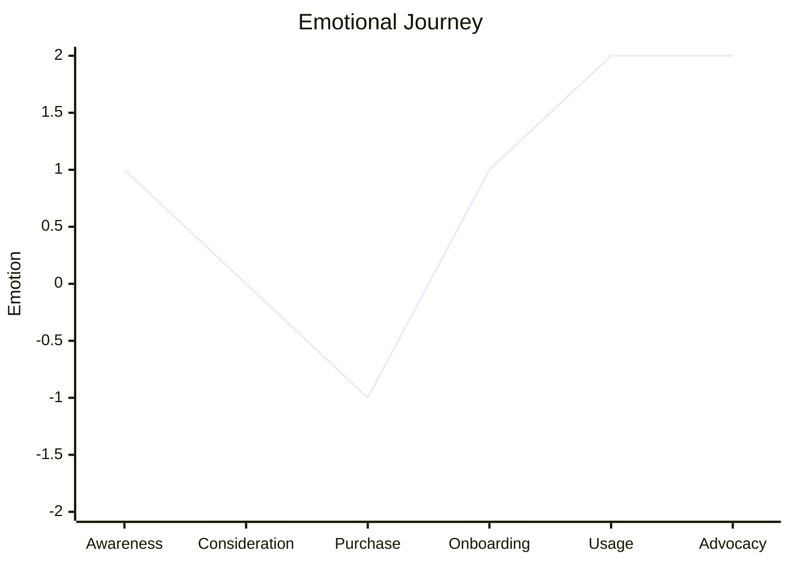
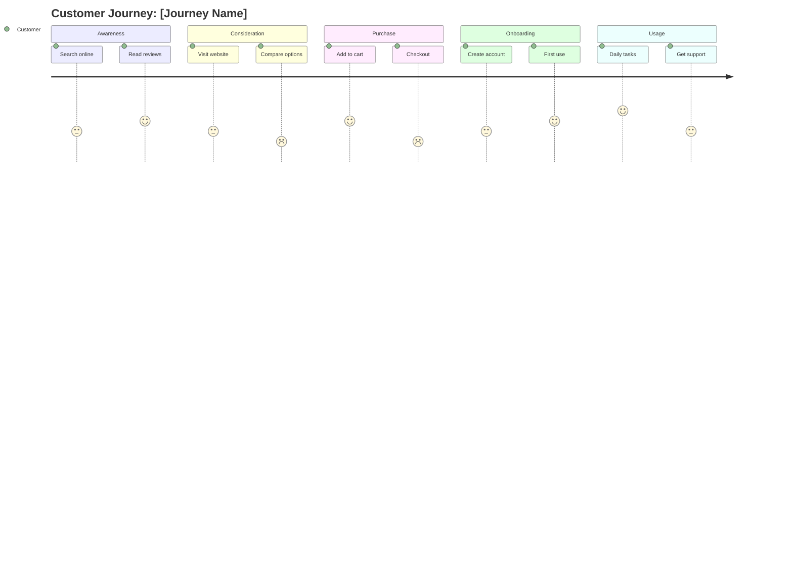

# Journey Map Command

Create a user or customer journey map to understand experiences, emotions, and identify improvement opportunities.

## Arguments

- `<journey-description>`: Description of the journey to map (e.g., "customer purchasing a subscription")
- `--mode`: Mapping mode (default: `guided`)
  - `full`: Comprehensive journey with detailed touchpoint analysis (~10K tokens)
  - `quick`: Rapid journey mapping (~4K tokens)
  - `guided`: Interactive journey discovery (variable)
- `--persona`: Optional persona name to use (creates new if not provided)

- `--dir`: Output directory (default: `docs/analysis/`)

## Execution

### Step 1: Parse Arguments

Extract journey description, mode, and persona from arguments.

If no description provided, ask the user:
"What journey would you like to map? Please describe:

- Who is taking this journey? (the user/customer)
- What are they trying to accomplish?
- Where does the journey start and end?"

Default mode is `guided`.

### Step 2: Load Journey Mapping Skill

Invoke the `journey-mapping` skill to access:

- Journey structure templates
- Persona development framework
- Emotion mapping guidance
- Moments of Truth definitions

### Step 3: Define or Select Persona

If persona provided, use it. Otherwise:

**Quick/Full Mode**: Create a default persona from context

**Guided Mode**: Work with user to define persona:

```markdown
Let's define the persona for this journey:

1. **Name**: [Give them a representative name]
2. **Role/Demographics**: [Who are they?]
3. **Goals**: [What do they want to achieve?]
4. **Frustrations**: [What typically frustrates them?]
5. **Quote**: [What might they say?]
```

### Step 4: Execute Based on Mode

#### Full Mode (Comprehensive Analysis)

Spawn the `journey-facilitator` agent for thorough mapping:

```text
Create a comprehensive journey map for:

[Journey description]

Persona: [Persona details if provided]

Requirements:
1. Define complete persona if not provided
2. Identify 4-6 journey phases
3. Map touchpoints, actions, thoughts, emotions for each phase
4. Plot emotion curve with intensity (+2 to -2)
5. Identify all pain points with severity rating
6. Discover opportunities for improvement
7. Analyze Moments of Truth (ZMOT, FMOT, SMOT, UMOT)
8. Prioritize opportunities by impact and effort
```

The agent will:

- Create detailed phase-by-phase analysis
- Generate emotion curve visualization
- Produce prioritized opportunity backlog
- Identify critical moments of truth

#### Quick Mode (Rapid Mapping)

Perform fast journey mapping:

1. Infer persona from context
2. Identify 4-5 obvious journey phases
3. Map key touchpoints per phase
4. Note obvious pain points
5. Estimate emotional highs and lows
6. Identify top 3 opportunities

#### Guided Mode (Interactive)

Work interactively through journey mapping using structured questions.

##### Step G1: Research Approach and Empathy Depth

Use AskUserQuestion to determine approach upfront:

```yaml
# Question 1: Research Approach (MCP: Design Thinking empathize phase)
question: "How should we approach understanding the user?"
header: "Approach"
options:
  - label: "Interviews (Recommended)"
    description: "Direct stakeholder conversations and quotes"
  - label: "Observation"
    description: "Watch users in their natural environment"
  - label: "Data Analysis"
    description: "Review existing usage data and feedback"
  - label: "Journey Mapping"
    description: "Map current user experience end-to-end"

# Question 2: Empathy Depth (MCP: Design Thinking - Five Whys, Empathy Mapping)
question: "What depth of empathy mapping do you need?"
header: "Depth"
options:
  - label: "Quick Scan (Recommended)"
    description: "Key pain points and needs only (~15 min)"
  - label: "Empathy Map"
    description: "Full Say/Think/Do/Feel quadrants (~30 min)"
  - label: "Five Whys"
    description: "Root cause analysis of problems (~45 min)"
```

##### Step G2: Persona

Define or confirm the persona for this journey.

##### Step G3: Journey Scope

Confirm trigger, goal, and end state.

##### Step G4: Phase Identification

Break journey into major phases (typically 4-6).

##### Step G5: Phase Deep-Dive

For each phase, explore based on depth from G1:

- Quick Scan: Key touchpoints and obvious pain points
- Empathy Map: Full Say/Think/Do/Feel for each phase
- Five Whys: Root cause analysis for major pain points

Standard questions per phase:

- "Where do they interact with us?" (Touchpoints)
- "What are they doing?" (Actions)
- "What are they thinking?" (Thoughts)
- "How are they feeling?" (Emotions - rate +2 to -2)
- "What frustrates them here?" (Pain Points)

##### Step G6: Moments of Truth

Identify critical interactions (ZMOT, FMOT, SMOT, UMOT).

##### Step G7: Opportunities

Brainstorm improvements based on pain point severity.

### Step 5: Generate Output Artifacts

#### Journey Map

```markdown
## Journey Map: [Journey Name]

**Date:** [ISO Date]
**Mode:** [full|quick|guided]

### Persona: [Name]

**Role:** [Description]
**Goals:** [What they want to achieve]
**Frustrations:** [Common pain points]
**Quote:** "[Characteristic statement]"

---

### Journey Overview

**Goal:** [What user wants to achieve]
**Trigger:** [What starts the journey]
**End State:** [What marks success]
**Time Frame:** [Typical duration]

---

### Phase 1: [Phase Name]

**Touchpoints:** [List channels/interactions]

**Actions:**
- [What user does]

**Thoughts:**
- [What user is thinking]

**Emotions:** [Emoji] [Description]
- **Intensity:** [+2/+1/0/-1/-2]

**Pain Points:**
- [Pain point with severity: High/Medium/Low]

**Opportunities:**
- [Improvement idea]

---

[Repeat for each phase]
```

#### Emotion Curve



#### Pain Point Inventory

```markdown
### Pain Point Inventory

| ID | Pain Point | Phase | Severity | Evidence | Root Cause |
|----|------------|-------|----------|----------|------------|
| PP1 | Confusing pricing page | Consideration | High | User testing | Too many options |
| PP2 | Slow checkout | Purchase | High | Analytics | 3rd party integration |
| PP3 | Unclear onboarding | Onboarding | Medium | Support tickets | Missing guidance |
```

#### Opportunity Backlog

```markdown
### Opportunity Backlog

| ID | Opportunity | Phase | Impact | Effort | Priority |
|----|-------------|-------|--------|--------|----------|
| O1 | Simplify pricing tiers | Consideration | High | Medium | 1 |
| O2 | Add progress indicator | Onboarding | High | Low | 2 |
| O3 | Optimize checkout API | Purchase | High | High | 3 |
```

#### Moments of Truth

```markdown
### Moments of Truth

| Moment | Phase | Current State | Desired State | Gap |
|--------|-------|---------------|---------------|-----|
| **ZMOT** (Pre-research) | Awareness | Mixed reviews | Positive reputation | Medium |
| **FMOT** (First encounter) | Consideration | Cluttered homepage | Clear value prop | High |
| **SMOT** (Using product) | Usage | Learning curve | Intuitive experience | Medium |
| **UMOT** (Sharing) | Advocacy | No prompt | Easy referral | Low |
```

#### Mermaid Journey Diagram



### Step 6: Save Results

Save outputs to:

- `docs/analysis/journey-map-[persona-name].md`

Use `--dir` to specify a custom output directory.

### Step 7: Suggest Follow-Up Actions

```markdown
## Suggested Next Steps

1. **Stakeholder Alignment**: Use `/ba:stakeholder-analyze` to identify journey owners
2. **Process Analysis**: Use `/ba:value-stream` to analyze operations behind pain points
3. **Capability Review**: Use `/ba:capability-map` to link touchpoints to capabilities
4. **Service Design**: Create service blueprint layering frontstage/backstage
5. **Prototype & Test**: Prototype solutions for high-priority opportunities
```
