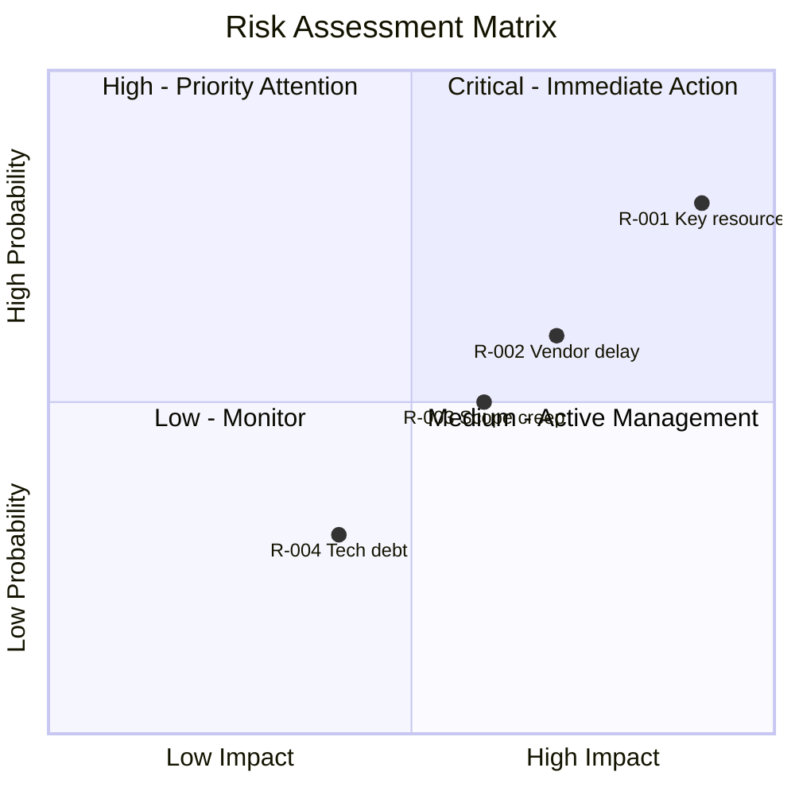

# Risk Register Command

Systematically identify, assess, and plan responses for risks using risk registers, probability/impact matrices, and mitigation strategies. Supports threats and opportunities.

## Arguments

- `<context-or-file>`: Project/initiative context or existing risk register file
- `--mode`: Operation mode (default: `create`)
  - `create`: Create new risk register (~6K tokens)
  - `update`: Add risks to existing register (~4K tokens)
  - `review`: Review and re-assess existing risks (~5K tokens)
- `--output`: Output format (default: `both`)
  - `yaml`: Structured YAML for downstream processing
  - `markdown`: Formatted markdown tables
  - `both`: Both formats

- `--dir`: Output directory (default: `docs/analysis/`)

## Execution

### Step 1: Parse Arguments

Extract context/file, mode, and output format from arguments.

If no context provided, ask the user:
"What project, initiative, or area would you like to assess for risks?"

Default mode is `create`. Default output is `both`.

### Step 2: Load Risk Analysis Skill

Invoke the `risk-analysis` skill to access:

- Risk identification techniques
- Probability and Impact scales
- Risk scoring methodology
- Response strategies (Avoid, Transfer, Mitigate, Accept)
- Risk register templates
- Monitoring and review processes

### Step 3: Execute Based on Mode

#### Create Mode (New Register)

##### Step A: Define Context

```markdown
## Risk Register Context

**Project/Initiative:** [Name]
**Owner:** [Risk register owner]
**Review Cycle:** [Weekly/Bi-weekly/Monthly]
**Risk Appetite:** [Conservative/Moderate/Aggressive]
**Date Created:** [ISO Date]
```

##### Step B: Identify Risks

Use multiple techniques to identify risks:

1. **Checklist Review**: Standard risk categories
   - Technical, Schedule, Cost, Resource, External, Quality, Security

2. **Assumption Analysis**: List and challenge assumptions
   - What are we assuming will go right?
   - What if those assumptions fail?

3. **Expert Input**: Domain-specific risks
   - What could go wrong in this domain?
   - What has failed before in similar projects?

4. **SWOT Threats**: From strategic analysis
   - External factors that could harm objectives

For each risk, capture:

- Clear description (cause + effect format)
- Category
- Initial assessment
- Potential impact areas

##### Step C: Assess Risks

Apply probability/impact scoring:

**Probability Scale (1-5):**

| Level | Score | Likelihood |
|-------|-------|------------|
| Very Low | 1 | < 10% |
| Low | 2 | 10-30% |
| Medium | 3 | 30-50% |
| High | 4 | 50-70% |
| Very High | 5 | > 70% |

**Impact Scale (1-5):**

| Level | Score | Schedule | Cost | Quality |
|-------|-------|----------|------|---------|
| Very Low | 1 | < 1 week | < 5% | Minor |
| Low | 2 | 1-2 weeks | 5-10% | Noticeable |
| Medium | 3 | 2-4 weeks | 10-20% | Significant |
| High | 4 | 1-3 months | 20-40% | Major |
| Very High | 5 | > 3 months | > 40% | Critical |

**Risk Score:** Probability × Impact (1-25)

**Priority Zones:**

| Score | Priority | Action |
|-------|----------|--------|
| 1-4 | Low | Accept or monitor |
| 5-9 | Medium | Active management |
| 10-14 | High | Priority attention |
| 15-25 | Critical | Immediate action |

##### Step D: Plan Responses

For each significant risk, define response strategy:

**For Threats:**

- **Avoid**: Eliminate the threat entirely
- **Transfer**: Shift to third party (insurance, contract)
- **Mitigate**: Reduce probability or impact
- **Accept**: Acknowledge with contingency plan

**For Opportunities:**

- **Exploit**: Ensure opportunity occurs
- **Share**: Partner to increase capability
- **Enhance**: Increase probability or impact
- **Accept**: Take advantage if it occurs

For each response, define:

- Prevention actions (reduce probability)
- Contingency actions (if risk occurs)
- Owner and target dates
- Residual risk after mitigation

#### Update Mode (Add to Existing)

1. Read existing risk register file
2. Identify new risks to add
3. Assess new risks using same scales
4. Plan responses for new risks
5. Update summary statistics
6. Preserve existing risk history

#### Review Mode (Re-assess)

1. Read existing risk register
2. For each open risk:
   - Has probability changed?
   - Has impact changed?
   - Have mitigation actions been completed?
   - Should status change (Open → Mitigated → Closed)?
3. Identify any new risks discovered during review
4. Update review date and notes
5. Adjust priorities based on current assessment

### Step 4: Generate Risk Matrix Visualization



### Step 5: Generate Output Artifacts

#### YAML Output

```yaml
risk_register:
  version: "1.0"
  name: "[Project/Initiative]"
  date: "[ISO Date]"
  owner: "[Name]"
  review_cycle: "bi-weekly"

  risk_appetite:
    overall: "moderate"
    schedule: "low"
    cost: "moderate"
    quality: "low"

  scales:
    probability:
      1: "Rare (<10%)"
      2: "Unlikely (10-30%)"
      3: "Possible (30-50%)"
      4: "Likely (50-70%)"
      5: "Almost Certain (>70%)"
    impact:
      1: "Very Low"
      2: "Low"
      3: "Medium"
      4: "High"
      5: "Very High"

  risks:
    - id: "R-001"
      description: "Key developer may leave during critical phase"
      category: "Resource"
      type: "threat"
      probability: 4
      impact: 5
      score: 20
      priority: "critical"
      owner: "[Name]"
      response_strategy: "mitigate"
      response_actions:
        prevention:
          - action: "Cross-train team member"
            owner: "[Name]"
            due_date: "[Date]"
            status: "in_progress"
        contingency:
          - trigger: "Developer gives notice"
            action: "Engage contractor immediately"
      residual_risk:
        probability: 3
        impact: 3
        score: 9
      status: "open"
      created_date: "[Date]"
      last_reviewed: "[Date]"
      notes: "[Additional context]"

  summary:
    total: 10
    by_priority:
      critical: 1
      high: 2
      medium: 4
      low: 3
    by_status:
      open: 8
      mitigated: 1
      closed: 1
      occurred: 0
    by_category:
      technical: 3
      resource: 2
      schedule: 2
      external: 2
      cost: 1

  review_log:
    - date: "[Date]"
      reviewer: "[Name]"
      changes: "[Summary of changes]"
```

#### Markdown Output

```markdown
## Risk Register: [Project/Initiative]

**Owner:** [Name]
**Last Updated:** [ISO Date]
**Review Cycle:** [Frequency]
**Next Review:** [Date]

### Risk Summary

| Priority | Count | Top Risk |
|----------|-------|----------|
| Critical | [#] | [Risk name] |
| High | [#] | [Risk name] |
| Medium | [#] | [Risk name] |
| Low | [#] | [Risk name] |

### Active Risks

| ID | Risk Description | Cat | P | I | Score | Owner | Response | Status |
|----|-----------------|-----|---|---|-------|-------|----------|--------|
| R-001 | Key developer departure | Resource | 4 | 5 | 20 | PM | Mitigate | Open |
| R-002 | Vendor API changes | Technical | 3 | 4 | 12 | Tech Lead | Mitigate | Open |
| R-003 | Scope creep | Schedule | 3 | 3 | 9 | PM | Accept | Open |

### Critical Risks (Score 15+)

#### R-001: Key Developer Departure

**Description:** Key developer may leave during critical phase

**Assessment:**
- Probability: 4 (Likely)
- Impact: 5 (Critical)
- Score: 20 (Critical Priority)

**Response Strategy:** Mitigate

**Prevention Actions:**
| Action | Owner | Due Date | Status |
|--------|-------|----------|--------|
| Cross-train team member | Tech Lead | [Date] | In Progress |
| Document critical knowledge | Developer | [Date] | Not Started |

**Contingency Plan:**
- Trigger: Developer gives notice
- Actions: Engage contractor, accelerate knowledge transfer

**Residual Risk:** Score 9 (Medium) after mitigation

### Response Tracking

| Risk | Action | Owner | Due | Status |
|------|--------|-------|-----|--------|
| R-001 | Cross-training | Tech Lead | [Date] | In Progress |
| R-001 | Documentation | Developer | [Date] | Not Started |
| R-002 | Abstraction layer | Dev | [Date] | Complete |

### Risk Trends

| Metric | This Period | Last Period | Trend |
|--------|-------------|-------------|-------|
| Total Risks | 10 | 8 | ↑ |
| Critical | 1 | 0 | ↑ |
| Mitigated | 1 | 2 | ↓ |
| Closed | 1 | 1 | → |
```

#### Summary Report

```markdown
## Risk Assessment Summary

**Project:** [Name]
**Date:** [ISO Date]
**Analyst:** ba-orchestrator

### Risk Profile

Overall risk exposure is [Low/Medium/High/Critical] based on:
- [#] critical risks requiring immediate attention
- [#] high-priority risks under active management
- Risk appetite alignment: [Aligned/Exceeded]

### Top 3 Risks

1. **R-001**: [Description] (Score: 20)
   - Response: [Strategy]
   - Status: [Current status]

2. **R-002**: [Description] (Score: 12)
   - Response: [Strategy]
   - Status: [Current status]

3. **R-003**: [Description] (Score: 9)
   - Response: [Strategy]
   - Status: [Current status]

### Recommendations

1. **Immediate**: Address R-001 mitigation actions
2. **This Week**: Complete R-002 abstraction layer
3. **Monitor**: Watch for new external risks
4. **Review**: Schedule stakeholder risk review
```

### Step 6: Save Results

Save outputs based on format flag:

**YAML file:**

- `docs/analysis/risk-register.yaml`

**Markdown file:**

- `docs/analysis/risk-register.md`

Use `--dir` to specify a custom output directory.

### Step 7: Suggest Follow-Up Actions

After completing risk assessment:

```markdown
## Suggested Next Steps

1. **Stakeholder Review**: Present risk register to stakeholders
2. **Mitigation Tracking**: Set up action tracking for response plans
3. **Root Cause Analysis**: Use `/ba:root-cause` for risks that occurred
4. **Decision Analysis**: Use decision-analysis skill for risk response options
5. **Schedule Reviews**: Set calendar reminders for risk reviews
6. **Integration**: Link to project management tool for tracking
```
