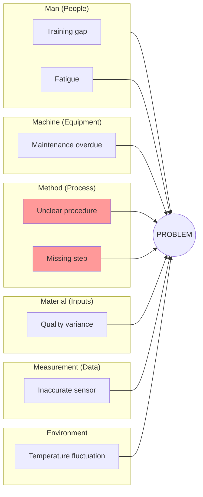

# Root Cause Analysis Command

Systematically diagnose problems and identify root causes using proven techniques: Fishbone (Ishikawa) diagrams for categorical exploration and 5 Whys for drilling to root causes. Develop actionable CAPA plans.

## Arguments

- `<problem-statement>`: Description of the problem to analyze
- `--mode`: Analysis technique (default: `full`)
  - `fishbone`: Fishbone diagram with 6M categories (~4K tokens)
  - `5whys`: 5 Whys drill-down technique (~3K tokens)
  - `full`: Both techniques combined (~8K tokens)
- `--output`: Output format (default: `both`)
  - `yaml`: Structured YAML for downstream processing
  - `mermaid`: Mermaid diagram visualization
  - `both`: Both formats

- `--dir`: Output directory (default: `docs/analysis/`)

## Execution

### Step 1: Parse Arguments

Extract problem statement, mode, and output format from arguments.

If no problem provided, ask the user:
"What problem would you like to analyze for root causes?"

Default mode is `full`. Default output is `both`.

### Step 2: Load Root Cause Analysis Skill

Invoke the `root-cause-analysis` skill to access:

- Fishbone (6M) categories
- 5 Whys methodology
- CAPA planning templates
- Problem definition framework
- Common pitfalls to avoid

### Step 3: Define the Problem

Before analysis, clarify the problem:

```markdown
## Problem Definition

**Problem Statement:** [Clear, specific description]
**Impact:** [Who/what is affected and how]
**Frequency:** [How often does it occur]
**First Observed:** [When was it first noticed]
**Current State:** [What's happening now]
**Desired State:** [What should be happening]
**Data Available:** [Evidence and metrics]
```

Verify: Is this the real problem or a symptom?

### Step 4: Execute Based on Mode

#### Fishbone Mode (6M Categories)

Explore causes across all 6M categories:

1. **Man (People)**: Human factors
   - Training, skills, motivation, fatigue, communication

2. **Machine (Equipment)**: Equipment factors
   - Maintenance, calibration, age, capacity, reliability

3. **Method (Process)**: Process factors
   - Procedures, standards, sequence, design, documentation

4. **Material (Inputs)**: Input factors
   - Quality, specifications, suppliers, storage, handling

5. **Measurement (Data)**: Data factors
   - Accuracy, frequency, instruments, definitions, collection

6. **Mother Nature (Environment)**: Environmental factors
   - Temperature, humidity, lighting, workspace, external conditions

For each category:

- Brainstorm potential causes
- Gather evidence for each cause
- Rate likelihood (High/Medium/Low)
- Identify relationships between causes

#### 5 Whys Mode (Drill-Down)

Progressive questioning to reach root cause:

```text
Problem: [Observed effect]

Why 1: Why does [problem] happen?
→ Because [cause 1]

Why 2: Why does [cause 1] happen?
→ Because [cause 2]

Why 3: Why does [cause 2] happen?
→ Because [cause 3]

Why 4: Why does [cause 3] happen?
→ Because [cause 4]

Why 5: Why does [cause 4] happen?
→ Because [ROOT CAUSE]
```

Verification: If we address [ROOT CAUSE], will the problem be resolved?

May require fewer or more than 5 whys - stop when you reach an actionable cause.

#### Full Mode (Combined Analysis)

Spawn the `problem-solver` agent for comprehensive analysis:

```text
Analyze this problem and identify root causes:

Problem: [Problem statement]

Requirements:
1. Define problem clearly with impact and evidence
2. Perform Fishbone analysis across all 6M categories
3. Apply 5 Whys to top 3 potential causes
4. Consolidate root causes with confidence ratings
5. Develop CAPA plan with immediate and preventive actions
6. Generate both YAML and Mermaid outputs
```

The agent will:

- Validate problem definition
- Systematically explore all cause categories
- Drill down to root causes
- Produce actionable CAPA plan

### Step 5: Consolidate Root Causes

Summarize findings:

```markdown
## Root Causes Identified

| # | Root Cause | Evidence | Confidence | Category |
|---|------------|----------|------------|----------|
| 1 | [Root cause 1] | [Data] | High | Method |
| 2 | [Root cause 2] | [Data] | Medium | Man |

**Primary Root Cause:** [Most significant cause]
**Contributing Factors:** [Secondary causes]
```

### Step 6: Develop CAPA Plan

Create corrective and preventive actions:

```markdown
## CAPA Plan

### Immediate Corrections
| Action | Owner | Target Date | Status |
|--------|-------|-------------|--------|
| [Quick fix] | [Name] | [Date] | Not Started |

### Corrective Actions (Address Root Cause)
| Action | Root Cause Addressed | Owner | Target Date |
|--------|---------------------|-------|-------------|
| [Fix action] | RC-1 | [Name] | [Date] |

### Preventive Actions (Prevent Recurrence)
| Action | What it Prevents | Owner | Target Date |
|--------|------------------|-------|-------------|
| [Prevention] | [Future issue] | [Name] | [Date] |

### Verification Plan
| Action | Verification Method | Success Criteria | Date |
|--------|---------------------|------------------|------|
| [Action] | [How to verify] | [What success looks like] | [Date] |
```

### Step 7: Generate Output Artifacts

#### YAML Output

```yaml
root_cause_analysis:
  version: "1.0"
  date: "[ISO Date]"
  analyst: "problem-solver"

  problem_definition:
    statement: "[Problem description]"
    impact: "[Who/what affected]"
    frequency: "[How often]"
    first_observed: "[When]"

  fishbone_analysis:
    man:
      - cause: "[Cause]"
        evidence: "[Data]"
        likelihood: high
    machine:
      - cause: "[Cause]"
        evidence: "[Data]"
        likelihood: medium
    method:
      - cause: "[Cause]"
        evidence: "[Data]"
        likelihood: high
    material:
      - cause: "[Cause]"
        evidence: "[Data]"
        likelihood: low
    measurement:
      - cause: "[Cause]"
        evidence: "[Data]"
        likelihood: medium
    mother_nature:
      - cause: "[Cause]"
        evidence: "[Data]"
        likelihood: low

  five_whys_chains:
    - starting_cause: "[Initial cause]"
      chain:
        - why: 1
          question: "Why does [X] happen?"
          answer: "[Because Y]"
        - why: 2
          question: "Why does [Y] happen?"
          answer: "[Because Z]"
      root_cause: "[Final root cause]"
      verified: true

  root_causes:
    primary: "[Main root cause]"
    contributing:
      - "[Contributing cause 1]"
      - "[Contributing cause 2]"

  capa_plan:
    immediate:
      - action: "[Quick fix]"
        owner: "[Name]"
        target_date: "[Date]"
    corrective:
      - action: "[Fix action]"
        root_cause: "RC-1"
        owner: "[Name]"
        target_date: "[Date]"
    preventive:
      - action: "[Prevention]"
        prevents: "[Future issue]"
        owner: "[Name]"
        target_date: "[Date]"
```

#### Mermaid Output

**Fishbone Diagram:**



#### Summary Report

```markdown
## Root Cause Analysis: [Problem]

**Date:** [ISO Date]
**Mode:** [fishbone|5whys|full]
**Analyst:** problem-solver

### Problem Summary

[Brief problem description with impact]

### Root Causes Identified

1. **Primary**: [Root cause] (Confidence: High)
2. **Contributing**: [Secondary causes]

### Key Findings

| Category | Top Cause | Evidence |
|----------|-----------|----------|
| Method | [Cause] | [Data] |
| Man | [Cause] | [Data] |

### CAPA Summary

- **Immediate Actions**: [Count]
- **Corrective Actions**: [Count]
- **Preventive Actions**: [Count]

### Recommendations

1. [Priority action]
2. [Secondary action]
3. [Monitoring action]
```

### Step 8: Save Results

Save outputs based on format flag:

**YAML file:**

- `docs/analysis/root-cause-analysis.yaml`

**Mermaid diagram:**

- `docs/analysis/root-cause-analysis.md`

Use `--dir` to specify a custom output directory.

### Step 9: Suggest Follow-Up Actions

After completing analysis:

```markdown
## Suggested Next Steps

1. **Risk Register**: Use `/ba:risk-register` to track identified threats
2. **Process Improvement**: Use `/ba:value-stream` to optimize the process
3. **Decision Analysis**: Use decision-analysis skill to evaluate corrective options
4. **Monitoring**: Set up metrics to verify CAPA effectiveness
```
