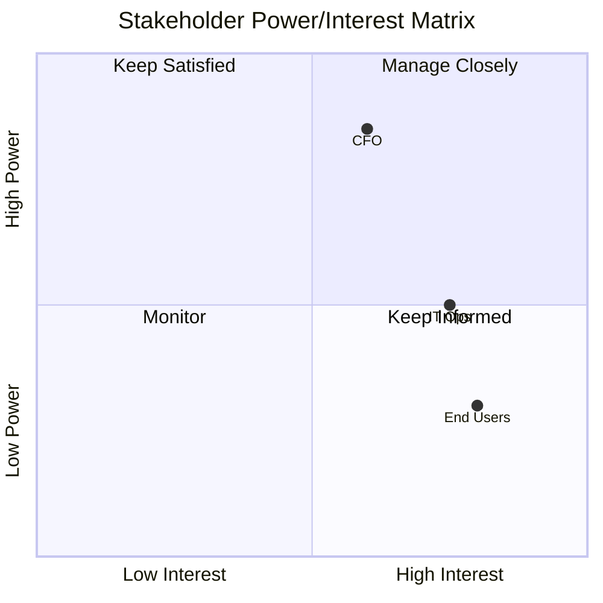

# Stakeholder Analyze Command

Identify, analyze, and plan engagement for stakeholders involved in an initiative, project, or change effort.

## Arguments

- `<initiative-description>`: Description of the initiative, project, or change to analyze stakeholders for
- `--mode`: Analysis mode (default: `guided`)
  - `full`: Multi-persona simulation with diverse perspectives (~10K tokens)
  - `quick`: Rapid stakeholder identification (~3K tokens)
  - `guided`: Interactive stakeholder discovery (variable)
- `--output`: Output artifacts (default: `all`)
  - `register`: Stakeholder register only
  - `matrix`: Power/Interest matrix only
  - `raci`: RACI matrix only
  - `all`: All artifacts

- `--dir`: Output directory (default: `docs/analysis/`)

## Execution

### Step 1: Parse Arguments

Extract initiative description, mode, and output format from arguments.

If no description provided, ask the user:
"What initiative, project, or change effort would you like to analyze stakeholders for?"

Default mode is `guided`. Default output is `all`.

### Step 2: Load Stakeholder Analysis Skill

Invoke the `stakeholder-analysis` skill to access:

- Stakeholder category frameworks
- Power/Interest matrix methodology
- RACI matrix rules
- Communication planning templates

### Step 3: Execute Based on Mode

#### Full Mode (Multi-Persona Simulation)

Spawn the `stakeholder-facilitator` agent for comprehensive analysis:

```text
Analyze stakeholders for this initiative:

[Initiative description]

Requirements:
1. Simulate perspectives from multiple organizational viewpoints
2. Use systematic stakeholder categories (sponsors, users, operators, etc.)
3. Assess Power, Interest, Influence, and Attitude for each
4. Create Power/Interest matrix with engagement strategies
5. Develop RACI matrix for key deliverables
6. Create communication plan
7. Identify potential resistance and mitigation strategies
```

The agent may spawn additional persona agents:

- `executive-sponsor-persona`: Strategic perspective, budget
- `end-user-persona`: Daily usage, pain points
- `operations-persona`: Support, maintenance concerns
- `compliance-persona`: Regulatory, audit requirements
- `devils-advocate`: Risks, overlooked stakeholders

#### Quick Mode (Rapid Assessment)

Perform fast stakeholder identification:

1. Identify obvious stakeholders from initiative description
2. Categorize by standard groups (RACI-style)
3. Apply default engagement strategies
4. Skip detailed influence analysis
5. Generate minimal register and matrix

#### Guided Mode (Interactive)

Work interactively through stakeholder discovery using structured questions.

##### Step G1: Initial Context Gathering

Use AskUserQuestion to gather critical context upfront:

```yaml
# Question 1: Stakeholder Group Discovery (MCP: stakeholder facilitation patterns)
question: "What stakeholder groups are most critical to this initiative?"
header: "Stakeholders"
multiSelect: true
options:
  - label: "Executive Sponsors"
    description: "C-level or senior leadership providing strategic direction and funding"
  - label: "End Users"
    description: "People who will use the system daily"
  - label: "Technical Teams"
    description: "Developers, architects, IT operations"
  - label: "External Partners"
    description: "Vendors, regulators, customers, partners"

# Question 2: Analysis Depth (MCP: CLI best practices - scope selection)
question: "What level of analysis do you need?"
header: "Depth"
options:
  - label: "Quick Assessment (Recommended)"
    description: "Power/Interest matrix only (~15 min)"
  - label: "Standard Analysis"
    description: "Matrix + RACI chart (~30 min)"
  - label: "Full Workshop"
    description: "Matrix + RACI + communication plan (~60 min)"
```

##### Step G2: Category Sweep

Based on the stakeholder groups selected, walk through each category:

- "Who sponsors/funds this initiative?"
- "Who will use the solution?"
- "Who operates/maintains systems involved?"
- "Who must approve or can block?"
- "Who else is affected by changes?"

##### Step G3: Assessment

For each identified stakeholder, assess:

- Power level (High/Medium/Low)
- Interest level (High/Medium/Low)
- Current attitude (Supporter/Neutral/Resistor)

##### Step G4: Matrix Placement

Confirm quadrant and engagement strategy for each stakeholder.

##### Step G5: Additional Artifacts

Based on depth selected in G1:

- Quick: Power/Interest matrix only
- Standard: Add RACI matrix for key deliverables
- Full: Add communication plan with frequency, channel, message

### Step 4: Generate Output Artifacts

#### Stakeholder Register

```markdown
## Stakeholder Register: [Initiative Name]

**Date:** [ISO Date]
**Mode:** [full|quick|guided]

| ID | Name/Role | Category | Power | Interest | Attitude | Influence |
|----|-----------|----------|-------|----------|----------|-----------|
| S01 | CFO | Sponsor | High | Medium | Neutral | High |
| S02 | End Users | User | Low | High | Supporter | Medium |
| S03 | IT Operations | Operator | Medium | High | Resistor | Medium |
```

#### Power/Interest Matrix



```markdown
### Engagement Strategies

**Manage Closely (High Power, High Interest):**
- [Stakeholder]: [Specific strategy]

**Keep Satisfied (High Power, Low Interest):**
- [Stakeholder]: [Specific strategy]

**Keep Informed (Low Power, High Interest):**
- [Stakeholder]: [Specific strategy]

**Monitor (Low Power, Low Interest):**
- [Stakeholder]: [Specific strategy]
```

#### RACI Matrix

```markdown
### RACI Matrix

| Deliverable | CFO | End Users | IT Ops | PM | Dev Team |
|-------------|-----|-----------|--------|-----|----------|
| Requirements | I | C | C | A | R |
| Design | I | C | C | A | R |
| Testing | I | R | C | A | R |
| Go-Live | A | I | R | R | C |

**Legend:** R=Responsible, A=Accountable, C=Consulted, I=Informed
```

#### Communication Plan

```markdown
### Communication Plan

| Stakeholder | Message Theme | Frequency | Channel | Owner |
|-------------|---------------|-----------|---------|-------|
| CFO | ROI, risk, timeline | Monthly | Executive brief | PM |
| End Users | Impact, training | Bi-weekly | Email, workshops | Change Lead |
| IT Ops | Technical needs | Weekly | Stand-ups | Tech Lead |
```

#### Resistance Analysis

```markdown
### Potential Resistance

| Stakeholder | Concern | Risk Level | Mitigation Strategy |
|-------------|---------|------------|---------------------|
| IT Ops | Job security | High | Involve early, retraining plan |
| [Other] | [Concern] | [Risk] | [Strategy] |
```

### Step 5: Save Results

Save outputs to:

- `docs/analysis/stakeholder-analysis.md`

Use `--dir` to specify a custom output directory.

### Step 6: Suggest Follow-Up Actions

```markdown
## Suggested Next Steps

1. **Capability Ownership**: Use `/ba:capability-map` to link stakeholders to capabilities
2. **Journey Impact**: Use `/ba:journey-map` to understand stakeholder experiences
3. **Change Management**: Develop detailed change management plan for resistors
4. **Communication Kick-off**: Schedule initial stakeholder briefings per plan
```
