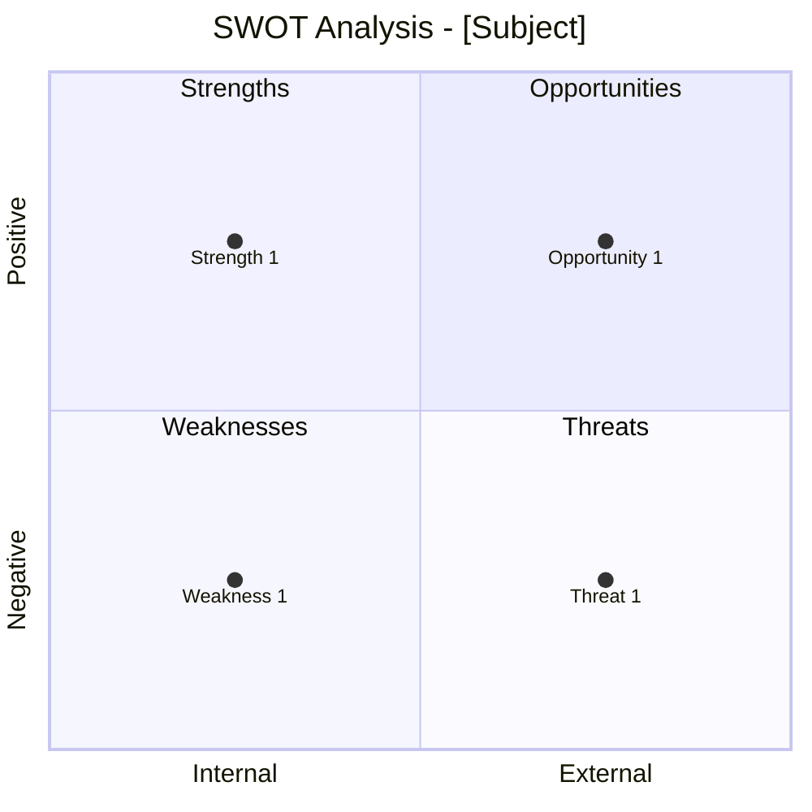

# SWOT Analysis Command

Perform strategic analysis using SWOT (Strengths, Weaknesses, Opportunities, Threats) and complementary frameworks to understand competitive positioning and environmental factors.

## Arguments

- `<subject>`: Organization, product, market, or initiative to analyze
- `--mode`: Analysis framework (default: `swot`)
  - `swot`: SWOT analysis only (~4K tokens)
  - `full`: SWOT + PESTLE + Porter's Five Forces (~12K tokens)
  - `pestle`: Macro-environment analysis only (~4K tokens)
  - `porter`: Industry structure analysis only (~4K tokens)
- `--output`: Output format (default: `both`)
  - `yaml`: Structured YAML for downstream processing
  - `mermaid`: Mermaid diagram visualization
  - `both`: Both formats

- `--dir`: Output directory (default: `docs/analysis/`)

## Execution

### Step 1: Parse Arguments

Extract subject, mode, and output format from arguments.

If no subject provided, ask the user:
"What organization, product, market, or initiative would you like to analyze?"

Default mode is `swot`. Default output is `both`.

### Step 2: Load SWOT-PESTLE Analysis Skill

Invoke the `swot-pestle-analysis` skill to access:

- SWOT matrix structure
- PESTLE categories
- Porter's Five Forces framework
- Strategic implications methodology
- Mermaid diagram templates

### Step 3: Execute Based on Mode

#### SWOT Mode (Default)

Analyze internal and external factors:

1. **Strengths (Internal)**: What does the subject do well? Competitive advantages?
2. **Weaknesses (Internal)**: What areas need improvement? Resource gaps?
3. **Opportunities (External)**: What trends or changes could be leveraged?
4. **Threats (External)**: What external factors could harm the subject?

Generate strategic implications:

- S-O Strategies: Use strengths to capture opportunities
- W-O Strategies: Address weaknesses to pursue opportunities
- S-T Strategies: Use strengths to counter threats
- W-T Strategies: Minimize weaknesses and avoid threats

#### Full Mode (All Frameworks)

Spawn the `strategic-analyst` agent for comprehensive analysis:

```text
Perform comprehensive strategic analysis:

Subject: [Subject description]

Requirements:
1. Complete SWOT analysis with evidence
2. PESTLE macro-environment scan
3. Porter's Five Forces industry analysis
4. Cross-framework synthesis
5. Prioritized strategic implications
6. Generate both YAML and Mermaid outputs
```

The agent will:

- Research current market data
- Cross-reference across frameworks
- Identify interconnected factors
- Produce comprehensive strategic assessment

#### PESTLE Mode (Macro-Environment)

Analyze external macro-environment factors:

1. **Political**: Government policy, stability, trade regulations
2. **Economic**: GDP, inflation, interest rates, employment
3. **Social**: Demographics, culture, lifestyle trends
4. **Technological**: Innovation, automation, R&D
5. **Legal**: Regulation, compliance, litigation
6. **Environmental**: Climate, sustainability, resources

Rate each factor by impact (High/Medium/Low) and likelihood.

#### Porter Mode (Industry Analysis)

Analyze industry competitive structure:

1. **Competitive Rivalry**: Intensity of competition
2. **Threat of New Entrants**: Barriers to entry
3. **Threat of Substitutes**: Alternative products/services
4. **Bargaining Power of Suppliers**: Supplier concentration
5. **Bargaining Power of Buyers**: Customer power

Rate each force (Strong/Moderate/Weak) with evidence.

### Step 4: Generate Output Artifacts

#### YAML Output

```yaml
strategic_analysis:
  version: "1.0"
  subject: "[Subject Name]"
  date: "[ISO Date]"
  mode: "[swot|full|pestle|porter]"
  analyst: "strategic-analyst"

  swot:
    strengths:
      - factor: "[Strength 1]"
        evidence: "[Supporting data]"
        impact: high
    weaknesses:
      - factor: "[Weakness 1]"
        evidence: "[Supporting data]"
        impact: medium
    opportunities:
      - factor: "[Opportunity 1]"
        evidence: "[Supporting data]"
        likelihood: high
    threats:
      - factor: "[Threat 1]"
        evidence: "[Supporting data]"
        likelihood: medium

  strategic_implications:
    offensive:  # S-O strategies
      - "[Strategy]"
    developmental:  # W-O strategies
      - "[Strategy]"
    defensive:  # S-T strategies
      - "[Strategy]"
    survival:  # W-T strategies
      - "[Strategy]"
```

#### Mermaid Output



#### Summary Report

```markdown
## Strategic Analysis: [Subject]

**Date:** [ISO Date]
**Mode:** [swot|full|pestle|porter]
**Analyst:** strategic-analyst

### SWOT Summary

| Strengths | Weaknesses |
|-----------|------------|
| [S1] | [W1] |
| [S2] | [W2] |

| Opportunities | Threats |
|---------------|---------|
| [O1] | [T1] |
| [O2] | [T2] |

### Strategic Priorities

1. **Offensive (S-O)**: [Top priority]
2. **Developmental (W-O)**: [Development area]
3. **Defensive (S-T)**: [Protection focus]

### Recommendations

1. [Priority recommendation]
2. [Secondary recommendation]
3. [Long-term consideration]
```

### Step 5: Save Results

Save outputs based on format flag:

**YAML file:**

- `docs/analysis/swot-analysis.yaml`

**Mermaid diagram:**

- `docs/analysis/swot-analysis.md`

Use `--dir` to specify a custom output directory.

### Step 6: Suggest Follow-Up Actions

After completing analysis:

```markdown
## Suggested Next Steps

1. **Business Model Review**: Use `/ba:business-model-canvas` to align model with strategic findings
2. **Capability Assessment**: Use `/ba:capability-map` to identify capability gaps
3. **Risk Analysis**: Use `/ba:risk-register` to elaborate on threats
4. **Decision Analysis**: Use decision-analysis skill to evaluate strategic options
```
