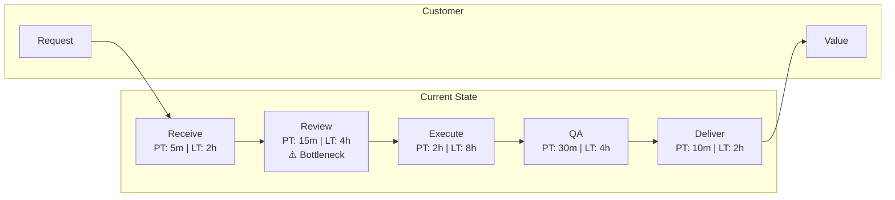
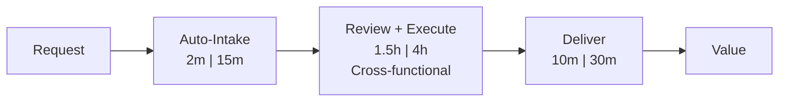

# Value Stream Command

Analyze a value stream to identify waste, bottlenecks, and improvement opportunities using Lean principles.

## Arguments

- `<process-description>`: Description of the value stream or process to analyze
- `--mode`: Analysis mode (default: `guided`)
  - `full`: Comprehensive analysis with current/future state maps (~12K tokens)
  - `quick`: Rapid waste identification (~4K tokens)
  - `guided`: Interactive value stream mapping (variable)
- `--output`: Output format (default: `both`)
  - `current`: Current state map only
  - `future`: Future state map only
  - `both`: Both current and future state

- `--dir`: Output directory (default: `docs/analysis/`)

## Execution

### Step 1: Parse Arguments

Extract process description, mode, and output format from arguments.

If no description provided, ask the user:
"What value stream or process would you like to analyze? Please describe:

- What value is delivered to the customer?
- What triggers the start of this process?
- What marks successful completion?"

Default mode is `guided`. Default output is `both`.

### Step 2: Load Value Stream Mapping Skill

Invoke the `value-stream-mapping` skill to access:

- VSM methodology and notation
- TIMWOODS waste categories
- Flow metrics definitions
- Improvement pattern library

### Step 3: Execute Based on Mode

#### Full Mode (Comprehensive Analysis)

Spawn the `value-stream-analyst` agent for thorough analysis:

```text
Analyze this value stream end-to-end:

[Process description]

Requirements:
1. Map current state with Process Time, Lead Time, %C&A for each step
2. Calculate flow efficiency
3. Identify waste by TIMWOODS category
4. Identify the system bottleneck (Theory of Constraints)
5. Design future state with improvement targets
6. Create prioritized improvement roadmap
7. Propose Kaizen events for top improvements
```

The agent will:

- Map complete current state with metrics
- Analyze waste systematically
- Design realistic future state
- Produce actionable roadmap

#### Quick Mode (Rapid Assessment)

Perform fast waste identification:

1. Identify major process steps
2. Estimate rough lead times
3. Identify obvious waste (waiting, handoffs, rework)
4. Calculate approximate flow efficiency
5. Flag the most obvious bottleneck
6. Suggest 3-5 quick wins

#### Guided Mode (Interactive)

Work interactively through value stream mapping:

1. **Define Scope**: Clarify customer, trigger, and end state
2. **Map Steps**: Walk through each process step
   - What happens in this step?
   - How long does the active work take (Process Time)?
   - How long until it moves to next step (Lead Time)?
   - What % are done right first time (%C&A)?
   - Who performs this step?
3. **Calculate Metrics**: Compute flow efficiency
4. **Identify Waste**: For each step, check TIMWOODS categories
5. **Find Bottleneck**: Identify the constraint
6. **Design Future**: Propose improvements and targets

### Step 4: Generate Output Artifacts

#### Current State Map

```markdown
## Current State Value Stream Map

**Value Stream:** [Name]
**Customer:** [Who receives value]
**Trigger:** [What starts the flow]
**End State:** [What marks completion]
**Date:** [ISO Date]

### Process Steps

| Step | Owner | PT | LT | %C&A | WIP | Notes |
|------|-------|-----|-----|------|-----|-------|
| Receive Request | Customer Service | 5m | 2h | 90% | 15 | Manual entry |
| Review & Prioritize | Manager | 15m | 4h | 85% | 20 | Bottleneck |
| Execute Work | Team | 2h | 8h | 95% | 10 | |
| Quality Check | QA | 30m | 4h | 80% | 8 | High rework |
| Deliver | Delivery | 10m | 2h | 99% | 5 | |

### Summary Metrics

- **Total Process Time:** 3h 0m
- **Total Lead Time:** 20h
- **Flow Efficiency:** 15%
- **Bottleneck:** Review & Prioritize (highest WIP)

### Waste Analysis (TIMWOODS)

| Waste Type | Location | Impact | Root Cause |
|------------|----------|--------|------------|
| **W**aiting | Review queue | 4h delay | Manager availability |
| **I**nventory | 20 items in review | WIP buildup | Batch processing |
| **D**efects | QA rework | 20% rework | Unclear requirements |
| **T**ransportation | Handoffs | 3 handoffs | Siloed teams |
```

#### Flow Diagram



#### Future State Map

```markdown
## Future State Value Stream Map

### Improvement Targets

| Metric | Current | Target | Improvement |
|--------|---------|--------|-------------|
| Lead Time | 20h | 8h | 60% reduction |
| Flow Efficiency | 15% | 40% | 2.7x improvement |
| %C&A (End-to-End) | 58% | 85% | 46% improvement |

### Proposed Changes

| Change | Addresses | Impact | Effort |
|--------|-----------|--------|--------|
| Cross-train reviewers | Bottleneck wait | -3h LT | Medium |
| Inline quality checks | Rework loop | -2h LT | Low |
| Automate intake | Manual entry | -1h LT | Medium |
| WIP limits | Inventory buildup | Better flow | Low |

### Future State Flow



#### Improvement Roadmap

```markdown
### Improvement Roadmap

**Priority 1 - Quick Wins (1-2 weeks)**

1. **WIP Limits**: Cap review queue at 10 items
2. **Visual Management**: Add Kanban board for visibility
3. **Clear standards**: Document definition of done

**Priority 2 - Process Changes (1-2 months)**

4. **Cross-training**: Train 2 additional reviewers
5. **Inline QA**: Move quality checks earlier in process

**Priority 3 - Automation (3-6 months)**

6. **Automated intake**: Build self-service intake form
7. **Workflow automation**: Automate routing and notifications

### Kaizen Event Proposals

| Event | Focus | Duration | Expected Outcome |
|-------|-------|----------|------------------|
| Bottleneck Blitz | Review step | 3 days | 50% wait reduction |
| Quality Workshop | QA rework | 2 days | Clear acceptance criteria |
```

### Step 5: Save Results

Save outputs to:

- `docs/analysis/value-stream-[name].md`

Use `--dir` to specify a custom output directory.

### Step 6: Suggest Follow-Up Actions

```markdown
## Suggested Next Steps

1. **Stakeholder Buy-in**: Use `/ba:stakeholder-analyze` to plan change management
2. **Journey Impact**: Use `/ba:journey-map` to understand customer experience impact
3. **Capability Alignment**: Use `/ba:capability-map` to link process to capabilities
4. **Architecture Review**: Use `/ea-document` to align systems with future state
```
