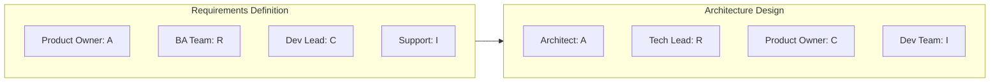

# RACI Matrix Reference

## RACI Definitions

| Role | Symbol | Definition | Key Points |
|------|--------|------------|------------|
| **Responsible** | R | Does the work | Multiple allowed per task |
| **Accountable** | A | Final decision authority | Exactly ONE per task |
| **Consulted** | C | Provides input BEFORE decision | Two-way communication |
| **Informed** | I | Notified AFTER decision | One-way communication |

## RACI Rules

### Rule 1: Every Row Must Have Exactly One A

- Someone must be accountable for every decision/deliverable
- Multiple accountable = no one accountable
- If unclear, escalate to define

### Rule 2: A Without R is a Red Flag

- Accountable person should have at least some responsibility
- Or must have strong delegation relationship with R

### Rule 3: Too Many Rs = Confusion

- Many responsible parties = coordination overhead
- Consider breaking task into smaller pieces
- Clarify who leads

### Rule 4: Everyone C = No One C

- Consulting everyone creates bottlenecks
- Be selective about who provides input
- Those not consulted can be Informed instead

### Rule 5: Gaps are OK

- Not everyone needs a role for every task
- Empty cell = no involvement needed
- But confirm it's intentional

## Common RACI Mistakes

| Mistake | Problem | Fix |
|---------|---------|-----|
| No A | No one owns it | Assign accountable person |
| Multiple As | Confusion, conflict | Single point of accountability |
| All Rs | Coordination nightmare | Lead R, supporting Rs |
| All Cs | Decision paralysis | Reduce to essential consultees |
| A without R | Accountability without doing | Either participate or delegate clearly |
| Missing stakeholders | Gaps in communication | Review completeness |
| Too granular | Overhead | Higher-level tasks |
| Too broad | Not actionable | More specific tasks |

## RACI Variations

### RASCI (Add Support)

| Role | Definition |
|------|------------|
| R | Responsible (does work) |
| A | Accountable (decides) |
| **S** | **Support (helps R)** |
| C | Consulted (input before) |
| I | Informed (notified after) |

**When to Use:**

- Large teams with supporting roles
- Need to distinguish lead from helpers

### DACI (Popularized by Atlassian)

| Role | Definition |
|------|------------|
| **D** | **Driver (drives to decision)** |
| A | Approver (has veto) |
| C | Contributor (provides input) |
| I | Informed (notified) |

**When to Use:**

- Decision-focused (vs. task-focused)
- Fast-moving teams
- Simpler model

### RAPID (Bain & Company)

| Role | Definition |
|------|------------|
| **R** | **Recommend (proposes)** |
| **A** | **Agree (must sign off)** |
| **P** | **Perform (implements)** |
| **I** | **Input (provides info)** |
| **D** | **Decide (final authority)** |

**When to Use:**

- Complex decisions with multiple sign-offs
- Enterprise-level governance
- Clear separation of recommend vs decide

## RACI Templates by Domain

### Software Development

| Activity | PO | Dev Lead | Developers | QA | Ops | Architect |
|----------|-----|----------|------------|-----|-----|-----------|
| Requirements | A | C | C | C | I | C |
| Architecture | I | R | C | I | C | A |
| Development | C | A | R | I | I | C |
| Code Review | I | A | R | C | I | C |
| Testing | C | C | R | A | I | I |
| Deployment | I | C | R | C | A | I |
| Production Support | I | C | C | I | A | C |

### Project Management

| Activity | Sponsor | PM | Steering | Team | Vendors |
|----------|---------|-----|----------|------|---------|
| Project Charter | A | R | C | I | I |
| Budget Approval | A | R | C | I | I |
| Scope Changes | A | R | C | I | I |
| Status Reporting | I | A | I | R | R |
| Risk Management | I | A | C | R | C |
| Go/No-Go Decision | A | R | C | I | I |

### Change Management

| Activity | Sponsor | Change Lead | Managers | Employees | HR |
|----------|---------|-------------|----------|-----------|-----|
| Change Strategy | A | R | C | I | C |
| Communication Plan | I | A | C | I | R |
| Training | I | A | R | I | R |
| Resistance Management | C | A | R | I | C |
| Adoption Metrics | I | A | R | I | C |

## Building a RACI

### Step 1: List Activities/Deliverables

Start with rows:

- Key decisions
- Major deliverables
- Process steps
- Milestones

### Step 2: Identify Roles/Stakeholders

Start with columns:

- Not individuals (roles change)
- Include all impacted roles
- Don't forget external parties

### Step 3: Assign R and A First

For each row:

1. Who does the work? → R
2. Who has final authority? → A (exactly one)

### Step 4: Add C and I

For each row:

1. Who must provide input? → C
2. Who needs to know? → I

### Step 5: Validate

- Every row has exactly one A
- No row is all C
- Stakeholders agree with their assignments
- No critical gaps

## RACI Meeting Facilitation

### Before the Meeting

- Prepare draft RACI
- Identify key stakeholders to attend
- Share draft for review

### During the Meeting

1. **Explain RACI definitions** (5 min)
2. **Walk through each row** (main discussion)
   - Confirm A first
   - Then R
   - Then C and I
3. **Identify conflicts** (note for resolution)
4. **Confirm understanding** (each person)

### After the Meeting

- Publish finalized RACI
- Store in accessible location
- Review quarterly or at milestones

## RACI Visualization

### Standard Matrix

```markdown
| Task | Role A | Role B | Role C | Role D |
|------|--------|--------|--------|--------|
| Task 1 | A | R | C | I |
| Task 2 | I | A | R | C |
| Task 3 | C | I | A | R |
```

### Color-Coded

Use color to quickly identify:

- 🔴 Red = A (Accountable)
- 🟡 Yellow = R (Responsible)
- 🔵 Blue = C (Consulted)
- ⚪ Gray = I (Informed)

### Mermaid Representation


